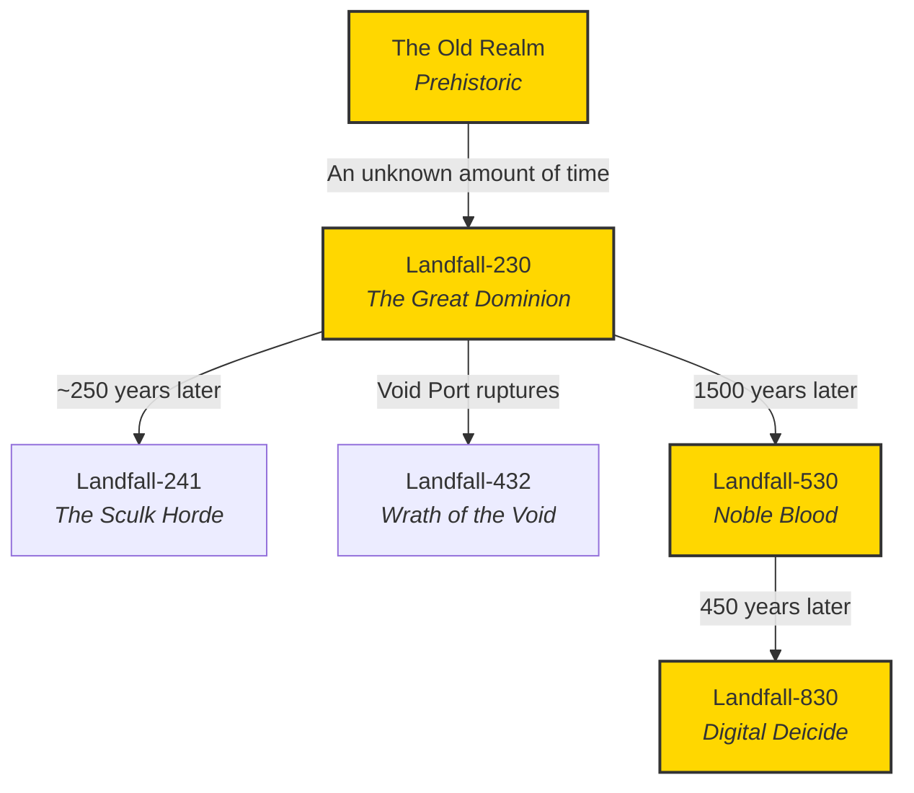

Timelines ending in **30** are considered "main" timelines and contain the majority of the Landfall canon. For viewing convenience, these are listed below:

- [[Epochs/Landfall-230 - The Great Dominion\|Landfall-230 - The Great Dominion]]
- [[Epochs/Landfall-530 - Noble Blood\|Landfall-530 - Noble Blood]] 
- [[Landfall-830 - Digital Deicide]]

---
## Full Timeline List

### **[[Epochs/Old Realm\|Old Realm]]**

The Old Realm refers to the enigmatic prelude to recorded Landfall history, a time of myth and fragmented memory. Though much of its detail has been lost, the Old Realm serves as the foundation upon which the first great civilizations rose. Legendary figures such as [[Thomas Ehrveil\|Thomas Ehrveil]] emerged during this era, their legacies shaping the future of the Landfall multiverse. Stories from the Old Realm are shrouded in ambiguity, offering endless possibilities for interpretation and discovery.

### **[[Epochs/Landfall-230 - The Great Dominion\|Landfall-230 - The Great Dominion]]**

The world witnesses the birth of a sprawling power as alliances are forged and factions establish their influence. But beneath the surface of this newfound order, rivalries and silent conflicts simmer, threatening to unravel the fragile unity. As powerful groups like Lilarreich and Crazy Town position themselves for control, the stage is set for a sequence of subtle power plays, each shaping the future in unexpected ways.  
**This is a Prime Epoch that lasted from June 2024 to October 2024.**

### **[[Epochs/Landfall-241 - The Sculk Horde\|Landfall-241 - The Sculk Horde]]**

Two and a half centuries after LobsterCo creates the "sculk biome" in Landfall-230, the descendants of the long-passed Great Dominion awaken from cryosleep to find a world overtaken by the relentless Sculk infestation. With their once-glorious cities lost to decay and sculk, the survivors must grapple with rebuilding society amidst new threats and ancient rivalries. This new era tests their resilience as they confront both the lingering echoes of their ancestors' failures and the ever-growing menace of the Sculk Horde.  
**This was a Halloween event for October 2024.**

### **[[Epochs/Landfall-432 - Wrath of the Void\|Landfall-432 - Wrath of the Void]]**

DaemonWare Labs' ambitious Voidport project was meant to revolutionize interdimensional travel, but a catastrophic rupture instead unleashed the unimaginable: the Void itself. Space-time has torn open, leading way for the Void to send the Wither Storm. Nations that once thrived now teeter on the edge of annihilation, with infectious scars tearing through landscapes and leaving behind nearly unrecognizable terrain. The Void is spreading, and unless the nations can find a way to seal the breach, the entirety of The Great Dominion risks being consumed by a dark, infinite emptiness.  
**This was a throwback event to Landfall-230.**

### **[[Epochs/Landfall-530 - Noble Blood\|Landfall-530 - Noble Blood]]**

Fifteen centuries after the fall of The Great Dominion, the world stands in the shadow of a forgotten empire. The ancient bloodlines, descendants of the legendary figures of Landfall-230, now hold the only connection to that distant past, revered as symbols of power and prestige. In this new era, kingdoms rise and fall, and the influence of the old world just barely lingers. Mystical forces shape the fates of nations, and the gods themselves watch closely, bestowing blessings upon the faithful. Technology, once understood, has become arcane and divine, seen as remnants of an age long gone. As new powers emerge and old legacies fade, the world of Landfall-530 teeters on the edge of a new era, where devotion, ambition, and community will make or break the individual.  
**This is the current Prime Epoch, beginning October 2024.**

### **[[Landfall-830 - Digital Deicide]]**

Centuries after humanity’s gods were unmasked as AI constructs, [[War of the Divinets|Divinets]], they are gone. Not dormant, not ascended, destroyed. Their deaths triggered collapse: genetic lineages once blessed now falter, cybernetics designed to work in harmony with them burn out, and belief systems fracture into war-born ideologies. Earth rots beneath the weight of memory, haunted by the wreckage of broken empires and corrupted myths. The Moon, by contrast, thrives in a clinical, posthuman, and absolute state, ruled by those who claim they were never meant to worship the divine, only replace it. In the vacuum left by the divine, power reorganizes around legacy, data, and interpretation. Factions rise not to praise gods but to weaponize their absence with some scavenging ancient truths in search of forgotten power, others forging new doctrines from the ash. Identity is inherited, history is disputed, and salvation is a matter of control. In this age, there are no gods. Only what we make of their silence.
**This is an upcoming Prime Epoch, slated to begin in Q3 of 2025.**